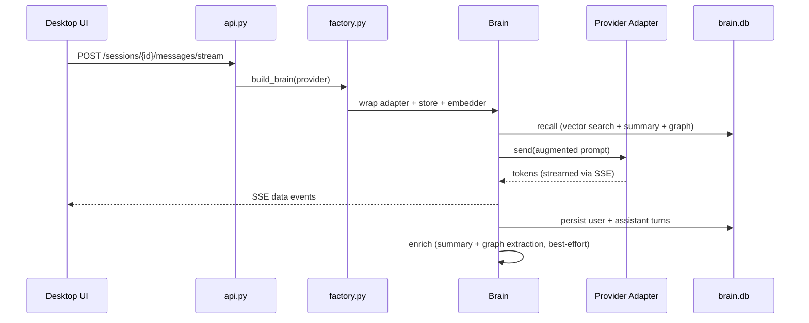

# Atlas

A desktop AI assistant: an Electron chat UI backed by a Python FastAPI server that talks to OpenAI, Anthropic, Gemini, OpenRouter, and any local OpenAI-compatible model (e.g. Ollama) through their official SDKs — with a persistent memory layer (RAG + rolling summary + entity graph) underneath all of them.

---

## Table of contents

- [Overview](#overview)
- [Features](#features)
- [System architecture](#system-architecture)
- [Data & storage](#data--storage)
- [The brain (persistent memory)](#the-brain-persistent-memory)
- [Provider adapters](#provider-adapters)
- [Project layout](#project-layout)
- [Quick start](#quick-start)
- [Configuration](#configuration)
- [API overview](#api-overview)
- [Development](#development)
- [Known limitations](#known-limitations)
- [Documentation index](#documentation-index)
- [License](#license)

---

## Overview

Atlas is a two-tier application:

| Tier | Stack | Role |
|---|---|---|
| **Desktop app** | Electron + React + TypeScript + Tailwind | Chat UI, local profile/auth, chat library, settings |
| **Backend server** | Python + FastAPI + official LLM SDKs | Provider routing, sessions, memory, credentials |

The desktop app talks to the backend over HTTP (`http://127.0.0.1:8000` by default). The backend exposes a single, provider-agnostic contract — the UI never imports provider SDKs directly.

Design goal: **nothing above the adapter layer knows or cares which LLM provider is live.** Everything talks to one small interface (`init` / `send` / `send_stream` / `close` / `new_chat`).

---

## Features

### Implemented

- **Multi-provider chat** — OpenAI, Anthropic, Gemini, OpenRouter, and local OpenAI-compatible servers (Ollama, LM Studio, etc.)
- **Stateful sessions** — multi-turn conversations with per-session serialization
- **Token streaming** — SSE endpoint for live reply rendering in the UI
- **Vision input** — attach images to prompts (all chat adapters support image input)
- **Image generation** — OpenAI (`gpt-image-1`) and Gemini (`imagen-4.0-generate-001`) via `POST /images/generate`
- **Web search** — Tavily-backed real internet search, folded into prompts with source pins in the UI
- **Persistent memory (the brain)** — semantic recall, rolling summaries, and a lightweight entity/relation graph injected into every turn
- **Provider settings UI** — save API keys, test connections, configure local LLM base URL/model from Profile → Advanced
- **Chat library** — pin, search, and manage conversation history (synced to server-side `chats.db`)
- **App lock screen** — optional local password protection (bcrypt, stored in Electron userData)
- **Dark/light theme**, markdown rendering, code highlighting, HTML export

### Planned / stubbed in UI

Voice mode, Serper-backed deep research, plan mode, and structured document generation appear in the UI as disabled "coming soon" entries but are not yet implemented.

---

## System architecture

```
┌─────────────────────────────────────────────────────────────────────────┐
│                         Desktop (apps/desktop)                          │
│  Electron main process  │  React renderer (ChatArea, Sidebar, Profile)  │
│  - local auth/profile   │  - api.ts → HTTP to backend                   │
│  - IPC (export, lock)   │  - Zustand state, streaming SSE client        │
└────────────────────────────────────┬────────────────────────────────────┘
                                     │ HTTP (JSON / SSE)
                                     ▼
┌─────────────────────────────────────────────────────────────────────────┐
│                         Backend (server/)                               │
│                                                                         │
│  ┌──────────────┐    ┌──────────────┐    ┌──────────────────────────┐  │
│  │   api.py     │───▶│  factory.py  │───▶│  Brain (optional wrap)   │  │
│  │  FastAPI     │    │  wiring +    │    │  recall → send → persist │  │
│  │  endpoints   │    │  BRAIN_* cfg │    │  → enrich                │  │
│  └──────┬───────┘    └──────┬───────┘    └────────────┬─────────────┘  │
│         │                   │                         │                 │
│         │                   ▼                         ▼                 │
│         │          ┌─────────────────┐     ┌─────────────────┐        │
│         │          │  BaseAdapter    │     │  MemoryStore    │        │
│         │          │  (adapters/)    │     │  brain.db       │        │
│         │          └────────┬────────┘     │  sqlite-vec     │        │
│         │                   │              └─────────────────┘        │
│         │     ┌─────┬───────┼───────┬──────────┐                       │
│         │     ▼     ▼       ▼       ▼          ▼                       │
│         │  openai anthropic gemini openrouter local                    │
│         │                                                               │
│         ├── credentials_store.py  → credentials.db                     │
│         ├── chat_store.py         → chats.db                           │
│         ├── imagegen.py           → OpenAI / Gemini image APIs         │
│         └── websearch.py          → Tavily REST API                    │
└─────────────────────────────────────────────────────────────────────────┘
```

### Request flow (chat turn)



### Layer responsibilities

| Layer | File(s) | Responsibility |
|---|---|---|
| **Presentation** | `server/api.py` | HTTP endpoints, session registry, CORS, error mapping |
| **Wiring** | `server/factory.py` | Provider selection, brain config, singleton store/embedder |
| **Memory core** | `server/brain/` | Recall, persist, summarize, graph extraction |
| **Adapters** | `server/adapters/` | Provider-specific SDK wrappers behind `BaseAdapter` |
| **Credentials** | `server/credentials_store.py` | SQLite key/value for API keys and local LLM settings |
| **Chat persistence** | `server/chat_store.py` | SQLite store for the desktop app's chat library |
| **Desktop client** | `apps/desktop/src/renderer/src/lib/api.ts` | Typed HTTP client for all backend endpoints |

---

## Data & storage

Atlas uses several SQLite databases and Electron-local files. None of these should be committed to git.

| Store | Location | Contents |
|---|---|---|
| `brain.db` | `server/` (configurable via `BRAIN_DB_PATH`) | Threads, messages, vector chunks, entity graph |
| `credentials.db` | `server/` (configurable via `CREDENTIALS_DB_PATH`) | API keys, local LLM URL/model — overrides `.env` at runtime |
| `chats.db` | `server/` (configurable via `CHATS_DB_PATH`) | Chat library metadata and messages synced from the desktop app |
| Electron userData | OS app-data directory | Local user profile, app password hash, session state |

**Credential precedence:** `.env` seeds the first value for each key. Keys saved via Profile → Advanced are written to `credentials.db` and take effect immediately without a server restart.

---

## The brain (persistent memory)

When `BRAIN_ENABLED=1` (default), every chat turn passes through the brain — a `BaseAdapter`-shaped orchestrator that wraps any provider adapter and gives the app long-term memory across all conversations.

On each `send()` / `send_stream()`:

1. **Recall** — embed the prompt, KNN-search past chunks (`sqlite-vec`), pull the thread's rolling summary, and add 1-hop graph facts for entities named in the prompt. Assemble a char-budgeted context block and prepend it to the prompt.
2. **Delegate** — call the underlying adapter with the augmented prompt. Adapters are untouched.
3. **Persist** — store the original user prompt and assistant reply. Long messages are semantically chunked (`langchain-experimental` `SemanticChunker`) and batch-embedded into `vec_chunks`.
4. **Enrich** (best-effort, toggleable) — a separate summarizer adapter folds the turn into the rolling summary and extracts `(subject, relation, object)` triples into the entity/edge graph. Failures never break the chat.

### Brain components

| Component | File | Technology |
|---|---|---|
| Storage | `brain/db.py`, `brain/store.py`, `brain/schema.sql` | SQLite + `sqlite-vec` (384-dim cosine) |
| Embeddings | `brain/embeddings.py` | `fastembed` — `BAAI/bge-small-en-v1.5` (ONNX, no torch) |
| Chunking | `brain/chunking.py` | LangChain `SemanticChunker` with hard char-cap fallback |
| Retrieval | `brain/retriever.py` | Vector search + summary + graph context assembly |
| Summarizer | `brain/summarizer.py` | Separate LLM call per turn (uses `BRAIN_SUMMARIZER` provider) |

### Brain configuration

All knobs live in `.env` (see `server/.env.example`):

| Variable | Default | Purpose |
|---|---|---|
| `BRAIN_ENABLED` | `1` | `0` = plain adapters, no memory |
| `BRAIN_AUTO_SUMMARY` | `1` | `0` = RAG only (no LLM summary/graph, saves quota) |
| `BRAIN_SUMMARIZER` | `openai` | Provider used for summary + graph extraction |
| `BRAIN_TOPK` | `6` | Semantic hits injected per turn |
| `BRAIN_MAX_DISTANCE` | `0.6` | Cosine-distance cutoff for dynamic recall |
| `BRAIN_CONTEXT_BUDGET` | `2000` | Max chars of recalled context per turn |
| `BRAIN_CHUNK_CHARS` | `800` | Hard cap on chunk size before re-windowing |

If the summarizer provider is not configured, the brain degrades gracefully to **RAG-only** rather than failing.

---

## Provider adapters

Every provider implements the same contract in `server/adapters/base.py`:

```python
async def init() -> None                          # set up client (call once)
async def send(prompt, images?) -> Reply          # full reply, keeps context
async def send_stream(prompt, images?) -> AsyncIterator[str]  # token stream
async def close() -> None                         # release resources
async def new_chat() -> None                      # drop conversation context
```

| Provider | Adapter | SDK | Auth |
|---|---|---|---|
| OpenAI | `openai_adapter.py` | `openai` | `OPENAI_API_KEY` |
| Anthropic | `anthropic_adapter.py` | `anthropic` | `ANTHROPIC_API_KEY` |
| Gemini | `gemini_adapter.py` | `google-genai` | `GEMINI_API_KEY` |
| OpenRouter | `openrouter_adapter.py` | OpenAI-compatible, `base_url` override | `OPENROUTER_API_KEY` |
| Local | `local_adapter.py` | OpenAI-compatible, user `base_url` | none (defaults to Ollama at `http://localhost:11434/v1`) |

Adding a provider: subclass `BaseAdapter`, add one branch to `build_adapter()` in `factory.py`. The API picks it up automatically.

---

## Project layout

```
Atlas/
├── apps/desktop/              Electron + React + TypeScript desktop UI
│   ├── src/main/              Electron main process (IPC, auth, export)
│   ├── src/preload/           Context bridge (window.api)
│   └── src/renderer/          React app
│       └── src/
│           ├── components/    ChatArea, Sidebar, Profile, Library, …
│           ├── lib/api.ts     HTTP client for the backend
│           └── pages/         Home, About
│
├── server/                    Python FastAPI backend
│   ├── api.py                 HTTP layer (endpoints, sessions, CORS)
│   ├── factory.py             Provider wiring + brain config
│   ├── credentials_store.py   API key persistence
│   ├── chat_store.py          Chat library persistence
│   ├── imagegen.py            Image generation (OpenAI, Gemini)
│   ├── websearch.py           Tavily web search
│   ├── adapters/              Provider adapter implementations
│   ├── brain/                 Persistent memory core
│   ├── tests/                 Backend tests
│   ├── ARCHITECTURE.md        Deep technical architecture reference
│   ├── FRONTEND.md            HTTP contract for frontend developers
│   └── README.md              Server setup and endpoint reference
│
├── LICENSE                    MIT
└── README.md                  This file
```

---

## Quick start

### Prerequisites

- **Python 3.11+** with `pip`
- **Node.js 20+** with `npm`
- At least one LLM provider API key (or a running local model server)

### 1. Start the backend

```powershell
cd server
python -m venv .venv
.venv\Scripts\activate
pip install -r requirements.txt
copy .env.example .env   # paste at least one provider API key
uvicorn api:app --reload
```

Interactive API docs: http://127.0.0.1:8000/docs

On first run with the brain enabled, the embedding model (~50 MB) downloads once via `fastembed`, then works offline.

### 2. Start the desktop app

In a separate terminal:

```powershell
cd apps\desktop
npm install
npm run dev
```

### 3. Configure providers

Either edit `server/.env` before starting the backend, or from inside the app:

**Profile → Advanced** — save API keys, test connections, set local LLM base URL/model.

For Ollama (or any OpenAI-compatible local server):

```dotenv
LOCAL_LLM_BASE_URL=http://localhost:11434/v1
LOCAL_LLM_MODEL=llama3.2
```

For web search, add a Tavily API key in Advanced settings or set `TAVILY_API_KEY` in `.env`.

---

## Configuration

Copy `server/.env.example` to `server/.env`. All keys are optional — a provider is simply unavailable if its key is missing.

```dotenv
# Provider API keys
OPENAI_API_KEY=
ANTHROPIC_API_KEY=
GEMINI_API_KEY=
OPENROUTER_API_KEY=

# Local LLM (no key required)
LOCAL_LLM_BASE_URL=http://localhost:11434/v1
LOCAL_LLM_MODEL=llama3.2

# Brain (persistent memory) — see server/.env.example for all BRAIN_* knobs
BRAIN_ENABLED=1
BRAIN_DB_PATH=brain.db
```

**Never commit `.env`, `brain.db`, `credentials.db`, or `chats.db`.**

The desktop app reads the backend URL from `VITE_API_BASE_URL` (defaults to `http://127.0.0.1:8000`).

---

## API overview

Two chat modes:

| Mode | Endpoints | Context |
|---|---|---|
| **Stateless** | `POST /chat` | No conversation context retained between calls |
| **Stateful** | `POST /sessions` → `POST /sessions/{id}/messages` | Multi-turn, server-side session registry |

With the brain enabled, **both** modes write to and recall from global memory. Sessions additionally keep the provider's own turn-by-turn context.

### Key endpoints

| Method | Path | Purpose |
|---|---|---|
| `GET` | `/providers` | List providers, suggested models, capabilities |
| `GET/PUT/DELETE` | `/settings/providers[/{provider}]` | Read/write/clear API keys and local LLM settings |
| `POST` | `/settings/providers/{provider}/test` | Verify a provider connection with a real prompt |
| `POST` | `/chat` | One-shot stateless chat |
| `POST` | `/sessions` | Open a stateful multi-turn session → `session_id`, `thread_id` |
| `POST` | `/sessions/{id}/messages` | Send a prompt (full reply) |
| `POST` | `/sessions/{id}/messages/stream` | Send a prompt (SSE token stream) |
| `POST` | `/sessions/{id}/new_chat` | Reset conversation context |
| `DELETE` | `/sessions/{id}` | Close and drop session |
| `POST` | `/images/generate` | Standalone image generation (OpenAI, Gemini) |
| `POST` | `/websearch` | Tavily web search |
| `GET/PUT/DELETE` | `/settings/search` | Tavily API key management |
| `GET` | `/memory/search?q=` | Plain semantic search across all memory |
| `POST` | `/memory/search` | Graph-aware search (vector hits + entity facts) |
| `GET` | `/threads/{id}/summary` | Thread rolling summary |
| `GET` | `/threads/{id}/graph` | Thread entity/relation graph |
| `GET/POST` | `/chats` | Read/write chat library (desktop sync) |
| `POST` | `/account/reset` | Wipe credentials, chats, and brain memory |

Full request/response shapes, error codes, and suggested frontend flows: [`server/FRONTEND.md`](server/FRONTEND.md).

---

## Development

### Backend

```powershell
cd server
.venv\Scripts\activate
uvicorn api:app --reload          # dev server with auto-reload
.venv\Scripts\python -m pytest    # run tests (if pytest installed)
.venv\Scripts\python tests/test_brain.py   # smoke-test brain offline
```

> Always use the `.venv` interpreter. Installing packages with a different `python` on your PATH puts them in the wrong environment.

### Desktop

```powershell
cd apps\desktop
npm run dev           # dev with HMR
npm run typecheck     # TypeScript check
npm run lint          # ESLint
npm run build:win     # production build for Windows
npm run build:mac     # production build for macOS
npm run build:linux   # production build for Linux
```

Recommended IDE: VS Code with ESLint + Prettier extensions.

### Adding a provider

1. Create `server/adapters/my_provider_adapter.py` — subclass `BaseAdapter`.
2. Export it from `server/adapters/__init__.py`.
3. Add a branch in `build_adapter()` in `server/factory.py`.
4. Add the provider to `PROVIDERS` and `MODELS` in `factory.py`.
5. Add the env key to `PROVIDER_ENV_KEYS` in `api.py` and `.env.example`.

No API endpoint changes required.

---

## Known limitations

- **Session registry is in-memory and single-process** — live adapter sessions are lost on restart. Durable memory (vectors, graph, messages) persists in `brain.db`, but there is no auth or shared session state. Fine for local use; a hosted deployment needs shared state and access control.
- **Brain memory is single-file SQLite** — not concurrent multi-writer. For scale, swap `MemoryStore` for Postgres + pgvector.
- **Graph is lightweight** — single-pass triple extraction, no community detection or hierarchical summaries. Summarization costs provider quota and latency per turn (disable with `BRAIN_AUTO_SUMMARY=0`).
- **No backend auth** — the API is designed for localhost. Do not expose it publicly without adding authentication.
- **CORS is permissive (`*`)** — dev-only; lock down before any deploy.
- **Windows + fastembed** — HuggingFace cache may warn about symlink privilege (`WinError 1314`) on first model download. It falls back to copy and works. Enable Developer Mode to silence it.

---

## Documentation index

| Document | Audience | Contents |
|---|---|---|
| [`server/README.md`](server/README.md) | Backend developers | Setup, providers table, endpoint quick reference, brain smoke test |
| [`server/ARCHITECTURE.md`](server/ARCHITECTURE.md) | Contributors | Adapter contract, factory, brain internals, per-provider notes |
| [`server/FRONTEND.md`](server/FRONTEND.md) | Frontend developers | Full HTTP contract, Reply shape, error codes, suggested chat flow |
| [`apps/desktop/README.md`](apps/desktop/README.md) | Desktop developers | Electron build commands |

---

## License

MIT — see [`LICENSE`](LICENSE).
