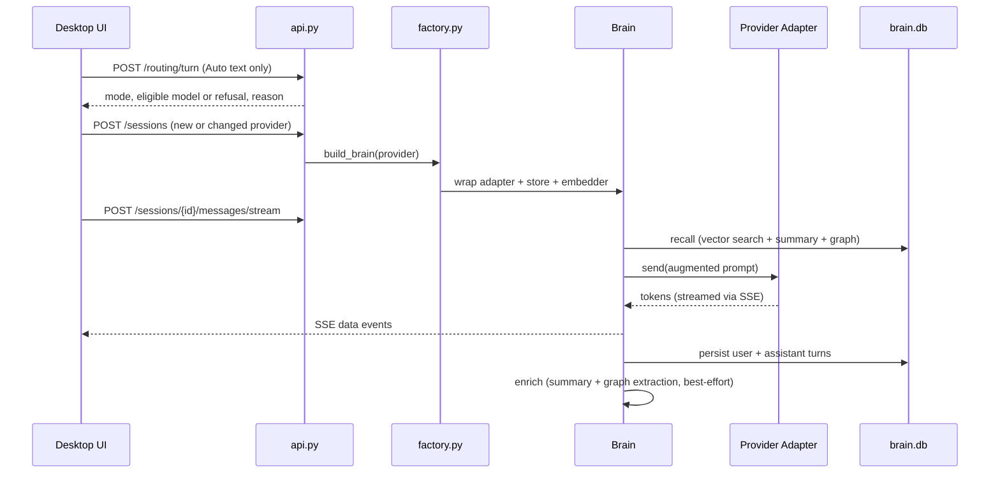
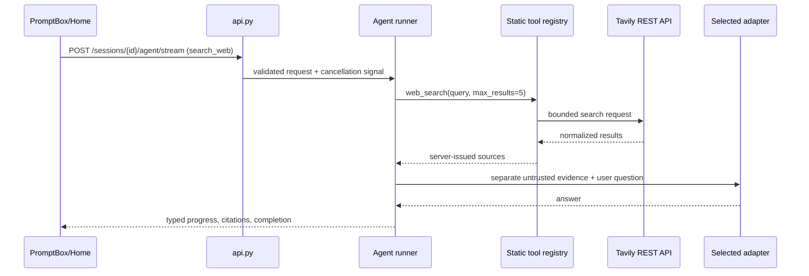
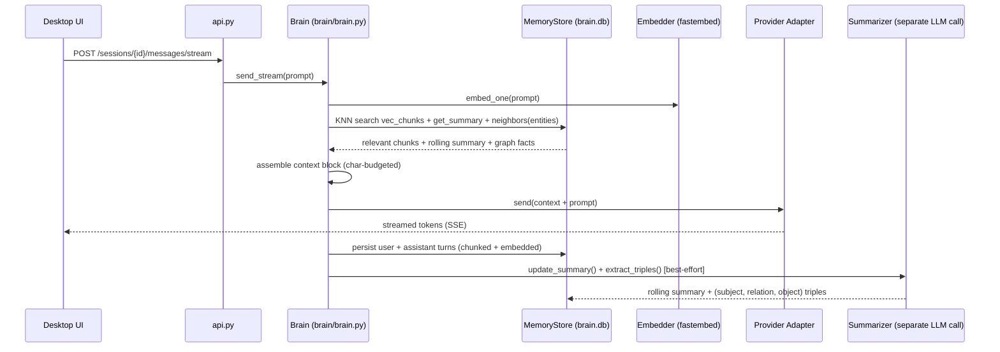

# Atlas

Atlas is a local-first desktop AI assistant. Its Electron app runs a loopback FastAPI backend for chat with user-configured OpenAI, Anthropic, Gemini, OpenRouter, or an OpenAI-compatible local runtime. Optional SQLite memory adds semantic recall, summaries, and an entity graph. "Local-first" describes where the app runs, **not** a promise that a selected cloud model, Tavily search, or Groq transcription keeps data on-device.


---

## Table of contents

- [Overview](#overview)
- [Features](#features)
- [System architecture](#system-architecture)
- [Feature flows](#feature-flows)
- [Data & storage](#data--storage)
- [The brain (persistent memory)](#the-brain-persistent-memory)
- [Provider adapters](#provider-adapters)
- [Project layout](#project-layout)
- [Quick start](#quick-start)
- [Configuration](#configuration)
- [API overview](#api-overview)
- [Development](#development)
- [Auto routing (text chat)](#auto-routing-text-chat)
- [macOS release](#macos-release)
- [Roadmap vs current build](#roadmap-vs-current-build)
- [Known limitations](#known-limitations)
- [Documentation index](#documentation-index)
- [License](#license)

---

## Overview

Atlas is a two-tier application:

| Tier | Stack | Role |
|---|---|---|
| **Desktop app** | Electron + React + TypeScript + Tailwind | Chat UI, local profile/auth, chat library, settings |
| **Backend server** | Python + FastAPI + official LLM SDKs | Provider routing, sessions, memory, credentials |

In development the desktop connects to the backend at `http://127.0.0.1:8000` by default; packaged builds launch an embedded backend on an available loopback port. Both require the same per-process bearer token. This protects the local API, **not** a multi-user cloud account. The UI never imports provider SDKs directly. Cloud model calls use the user's own provider keys stored locally; Atlas-managed cloud accounts, plans, and inference are [proposals](#roadmap-vs-current-build), not runtime features.

Design goal: **nothing above the adapter layer needs provider-specific SDK logic.** Ordinary chat uses the stable `init` / `send` / `send_stream` / `close` / `new_chat` contract; agent runs use normalized `TurnMessage` and bounded tool-call contracts where the selected model advertises support.

---

## Features

### Implemented

- **Multi-provider chat** — OpenAI, Anthropic, Gemini, OpenRouter, and local OpenAI-compatible servers (Ollama, LM Studio, etc.)
- **Auto and explicit text modes** — deterministic per-turn Auto classification (Research, Coding, Documentation), explainable local model routing, and explicitly selected configured cloud models; a mode label does not grant a tool or web access
- **Stateful sessions** — multi-turn conversations with per-session serialization
- **Token streaming** — SSE endpoint for live reply rendering in the UI
- **Vision input** — attach images to prompts (all chat adapters support image input)
- **Image generation** — OpenAI (`gpt-image-1`) and Gemini (`imagen-4.0-generate-001`) via `POST /images/generate`
- **Web search** — one bounded Tavily query (up to 5 displayed results) with source IDs, citations, and cancellation
- **Research mode** — plans up to 3 queries, keeps 12 unique results, reads at most 3 public pages, and validates citations within a 90-second run; selected text files stay local to that run
- **Safe tools** — bounded read-only provider tool calls for supported OpenAI, Anthropic, and Gemini models; no shell, arbitrary paths, or code execution
- **Coding and Documentation text modes; explicit Plan workflow** — affect task framing or produce a visible outline; none alone executes code or writes files
- **Document drafts** — choose a research brief, comparison, decision memo, or README; review the complete Markdown draft and destination before explicitly saving
- **Voice typing** — mic-button dictation: records audio in the renderer and transcribes it via Groq's `whisper-large-v3-turbo` API (see [Feature flows](#feature-flows))
- **Persistent memory (the brain)** — optional semantic chat recall, rolling summaries, and a lightweight entity/relation graph; enrichment can degrade independently of replies
- **Selected-document index** — explicitly selected UTF-8 `.txt`/`.md` files (up to 1 MiB each), searchable locally with source/chunk IDs; not automatic chat retrieval or folder crawling
- **Local runtime control** — opt-in start/status/stop for an already-installed Ollama on macOS ARM64; Atlas stops only the process it started and never downloads models
- **Provider settings UI** — save API keys, test connections, configure local LLM base URL/model from Profile → Advanced
- **Chat library** — pin, search, and manage conversation history (synced to server-side `chats.db`)
- **App lock screen** — optional local password protection (bcrypt, stored in Electron userData)
- **Dark/light theme**, markdown rendering, code highlighting, HTML export

### Not included

Research Nodes/workspaces, PDF/Office ingestion, automatic document writes, arbitrary shell/code execution, and model-selected tools for OpenRouter/local models are not available. Drafts remain chat artifacts until the user confirms a destination and save. The per-thread graph API exists, but a graph visualization UI, MCP/custom Skills, Atlas-managed cloud models, subscriptions, and usage quotas are not shipped.

---

## System architecture

```
┌─────────────────────────────────────────────────────────────────────────┐
│                         Desktop (apps/desktop)                          │
│  Electron main process  │  React renderer (ChatArea, Sidebar, Profile)  │
│  - local auth/profile   │  - api.ts → HTTP to backend                   │
│  - IPC (export, lock)   │  - Zustand state, streaming SSE client        │
└────────────────────────────────────┬────────────────────────────────────┘
                                     │ HTTP (JSON / SSE)
                                     ▼
┌─────────────────────────────────────────────────────────────────────────┐
│                         Backend (server/)                               │
│                                                                         │
│  ┌──────────────┐    ┌──────────────┐    ┌──────────────────────────┐  │
│  │   api.py     │───▶│  factory.py  │───▶│  Brain (optional wrap)   │  │
│  │  FastAPI     │    │  wiring +    │    │  recall → send → persist │  │
│  │  endpoints   │    │  BRAIN_* cfg │    │  → enrich                │  │
│  └──────┬───────┘    └──────┬───────┘    └────────────┬─────────────┘  │
│         │                   │                         │                 │
│         │                   ▼                         ▼                 │
│         │          ┌─────────────────┐     ┌─────────────────┐        │
│         │          │  BaseAdapter    │     │  MemoryStore    │        │
│         │          │  (adapters/)    │     │  brain.db       │        │
│         │          └────────┬────────┘     │  sqlite-vec     │        │
│         │                   │              └─────────────────┘        │
│         │     ┌─────┬───────┼───────┬──────────┐                       │
│         │     ▼     ▼       ▼       ▼          ▼                       │
│         │  openai anthropic gemini openrouter local                    │
│         │                                                               │
│         ├── credentials_store.py  → credentials.db                     │
│         ├── chat_store.py         → chats.db                           │
│         ├── imagegen.py           → OpenAI / Gemini image APIs         │
│         ├── websearch.py          → Tavily REST API (search + research)│
│         └── voice.py              → Groq Whisper API (voice typing)    │
└─────────────────────────────────────────────────────────────────────────┘
```

### Request flow (chat turn)


```mermaid
sequenceDiagram
    participant UI as Desktop UI
    participant API as api.py
    participant Factory as factory.py
    participant Brain as Brain
    participant Adapter as Provider Adapter
    participant Store as brain.db

    UI->>API: POST /routing/turn (Auto text only)
    API-->>UI: mode, eligible model or refusal, reason
    UI->>API: POST /sessions (new or changed provider)
    API->>Factory: build_brain(provider)
    Factory->>Brain: wrap adapter + store + embedder
    UI->>API: POST /sessions/{id}/messages/stream
    Brain->>Store: recall (vector search + summary + graph)
    Brain->>Adapter: send(augmented prompt)
    Adapter-->>Brain: tokens (streamed via SSE)
    Brain-->>UI: SSE data events
    Brain->>Store: persist user + assistant turns
    Brain->>Brain: enrich (summary + graph extraction, best-effort)
```

### Layer responsibilities

| Layer | File(s) | Responsibility |
|---|---|---|
| **Presentation** | `server/api.py` | Authenticated HTTP endpoints, session registry, error mapping |
| **Routing and policy** | `server/routing.py`, `server/policy.py` | Deterministic Auto classification, eligibility filtering, explicit no-route state; no tool grant |
| **Wiring** | `server/factory.py` | Provider selection, brain config, singleton store/embedder |
| **Memory core** | `server/brain/` | Recall, persist, summarize, graph extraction |
| **Adapters** | `server/adapters/` | Provider-specific SDK wrappers behind `BaseAdapter` |
| **Credentials** | `server/credentials_store.py` | SQLite key/value for API keys and local LLM settings |
| **Chat persistence** | `server/chat_store.py` | SQLite store for the desktop app's chat library |
| **Agent workflows/tools** | `server/agents/`, `server/tools/` | Run policy, bounded Research, static tool registry, safe page fetch and selected-file search |
| **Web search / research** | `server/websearch.py` | Tavily REST API transport shared by Search and Research |
| **Voice typing** | `server/voice.py` | Groq Whisper (`whisper-large-v3-turbo`) transcription wrapper |
| **Desktop client** | `apps/desktop/src/renderer/src/lib/api.ts` | Typed HTTP client for all backend endpoints |

---

## Feature flows

The current composer selects one intent, mapped to a typed text mode or an explicit workflow action. `Home.tsx` calls Auto routing only for ordinary text chat; selecting Search, Research, Safe Tools, or Draft enters its own server-owned agent workflow instead. The backend owns tool policy, limits, provider calls, and evidence. An Auto classification of "Research" does **not** run Tavily or prove that the answer is researched. Image generation, voice transcription, and Brain memory have separate paths.

### 1. Web search (Tavily)

Selecting **Search** runs one bounded Tavily query (up to 5 results). The backend passes source records as untrusted evidence to the selected model; it does not prepend search output to the user's prompt. Results are scoped to the run, citations use server-issued `[S#]` IDs, and the renderer opens only sources attached to that assistant message. Stop/disconnect cancels the search and prevents synthesis. Search inputs are limited to 1,000 characters; `/websearch` remains a validated compatibility endpoint, but the desktop agent mode uses `/sessions/{id}/agent/stream`.


```mermaid
sequenceDiagram
    participant UI as PromptBox/Home
    participant API as api.py
    participant Runner as Agent runner
    participant Registry as Static tool registry
    participant Tavily as Tavily REST API
    participant Model as Selected adapter

    UI->>API: POST /sessions/{id}/agent/stream (search_web)
    API->>Runner: validated request + cancellation signal
    Runner->>Registry: web_search(query, max_results=5)
    Registry->>Tavily: bounded search request
    Tavily-->>Registry: normalized results
    Registry-->>Runner: server-issued sources
    Runner->>Model: separate untrusted evidence + user question
    Model-->>Runner: answer
    Runner-->>UI: typed progress, citations, completion
```

### 2. Research mode

Research is a separate bounded workflow: one schema-validated planner produces 1–3 queries from the user question and recent typed conversation; Tavily requests run concurrently with at most 8 results each; results are deduplicated to 12; no more than 3 server-issued source IDs are fetched. Fetches allow public HTTP(S) text only, revalidate DNS and redirects, and cap each page at 10 seconds, 1 MiB, and 12,000 extracted characters. The entire run has a 90-second deadline.

Evidence is passed separately from the prompt and explicitly treated as untrusted. Up to 5 selected text files may be searched locally; file contents never enter Tavily queries. Inline web citations use `[S#]`, local-file citations use `[A#]`. Unknown IDs are removed; citation repair runs at most once, and missing/invalid citations or failed evidence mark the run partial. This structural check confirms ID existence, not claim truth.

The UI shows the query plan, result/fetch counts, source cards, and partial/error states. Raw pages and tool arguments are not sent to Brain memory; one user question and one final answer are persisted for the logical turn. Stopping or disconnecting prevents subsequent work.

### 3. Safe tools and document drafts

**Safe tools** is a per-message, read-only grant. It exposes only statically registered tools: public search/page fetch when no Brain or selected files are in scope, or current-thread memory and selected-file reads when private context is in scope. Search and Research remain the routes for public web queries with private context. The server enforces model capability, input schemas, call IDs, allowed names, a 4-round/6-call budget, a 90-second deadline, and output limits. Only the listed OpenAI, Anthropic, and Gemini models are enabled; OpenRouter and local models remain disabled. There is no shell, arbitrary code, SQL, disk-path access, or automatic write.

**Draft document** returns a Markdown chat artifact in one of four templates: research brief, comparison, decision memo, or README. It has no disk side effect. The user can review the complete content, choose a destination in Electron's native save dialog, see the selected path, and explicitly confirm save/replace. Electron main validates the filename and content, writes a temporary file in the destination directory, and atomically creates or replaces the selected file. The model never supplies an absolute path.

### 4. RAG / persistent memory (the brain)

When enabled, Brain wraps ordinary chat independently of the selected text mode. Explicit agent workflows use a separate bounded run path and persist the original question/final answer once, rather than embedding every intermediate tool result. Voice transcription becomes ordinary text after the user sends it.


```mermaid
sequenceDiagram
    participant UI as Desktop UI
    participant API as api.py
    participant Brain as Brain (brain/brain.py)
    participant Store as MemoryStore (brain.db)
    participant Embed as Embedder (fastembed)
    participant Adapter as Provider Adapter
    participant Sum as Summarizer (separate LLM call)

    UI->>API: POST /sessions/{id}/messages/stream
    API->>Brain: send_stream(prompt)
    Brain->>Embed: embed_one(prompt)
    Brain->>Store: KNN search vec_chunks + get_summary + neighbors(entities)
    Store-->>Brain: relevant chunks + rolling summary + graph facts
    Brain->>Brain: assemble context block (char-budgeted)
    Brain->>Adapter: send(context + prompt)
    Adapter-->>UI: streamed tokens (SSE)
    Brain->>Store: persist user + assistant turns (chunked + embedded)
    Brain->>Sum: update_summary() + extract_triples() [best-effort]
    Sum-->>Store: rolling summary + (subject, relation, object) triples
```

Notes specific to how this interacts with the other three features:
- **Raw Search/Research pages and tool arguments are not embedded into `brain.db`.** An agent turn stores the original user question and final assistant answer once; the answer can still contain evidence-based facts that may be recalled later.
- **Voice-typed text is just text** — once transcription fills the textarea, that message goes through the exact same recall → send → persist → enrich pipeline as anything typed by hand. The brain has no idea it originated from audio.
- If the summarizer provider isn't configured, enrichment is skipped and the turn still gets recall + persistence (RAG-only degradation — see [The brain](#the-brain-persistent-memory)).

Full detail on chunking, embeddings, and the entity graph: [The brain (persistent memory)](#the-brain-persistent-memory).

### 5. Voice typing (Groq Whisper)

The browser's built-in `SpeechRecognition` (`webkitSpeechRecognition`) doesn't work in Electron — its backend is Google's speech service, gated behind an API key baked into official Chrome builds only, so it fails with a `network` error in any Chromium embedder. Voice typing instead records real audio locally and transcribes it server-side via Groq's Whisper API.

```mermaid
sequenceDiagram
    participant User
    participant Box as PromptBox (renderer)
    participant Rec as MediaRecorder
    participant API as api.py
    participant Voice as voice.py
    participant Groq as Groq Whisper API

    User->>Box: click mic
    Box->>Rec: getUserMedia({audio:true}) + start()
    User->>Box: click mic again (stop)
    Rec-->>Box: audio Blob (webm/opus)
    Box->>Box: Blob → base64 (FileReader)
    Box->>API: POST /audio/transcribe {data, mime}
    API->>Voice: transcribe(api_key, data, mime)
    Voice->>Groq: multipart POST /openai/v1/audio/transcriptions<br/>(model = whisper-large-v3-turbo)
    Groq-->>Voice: {text}
    Voice-->>API: text
    API-->>Box: {text}
    Box->>Box: insert into textarea (appended to any existing draft)
```

The Groq API key is stored the same way as every other provider key — via `credentials_store.py` (`GROQ_API_KEY`), managed from **Profile → Advanced → Voice typing**. If no key is configured, `/audio/transcribe` returns `400` and the UI shows "Add a Groq API key in Profile → Advanced to enable voice typing." instead of a raw error. Recording state (idle / recording / transcribing) is all client-side — the backend has no notion of an in-progress recording.

Key files: `chatgpt-prompt-input.tsx` (`handleMicClick`, `handleTranscription`), `server/api.py` (`POST /audio/transcribe`, `/settings/voice`), `server/voice.py`.

---

## Data & storage

Atlas keeps user data locally. When started from `server/` in development, the database defaults below resolve there; packaged Electron sets explicit paths under its OS `userData` directory. Do not commit any of these files.

| Store | Contents |
|---|---|
| `brain.db` (`BRAIN_DB_PATH`) | Chat memory, vector chunks, selected-document index, entity graph |
| `credentials.db` (`CREDENTIALS_DB_PATH`) | Your provider keys and local-runtime settings; not Atlas-managed shared keys |
| `chats.db` (`CHATS_DB_PATH`) | Chat library metadata and messages synced from the desktop |
| Electron `userData` | Local profile, app password hash, session and attachment files; packaged backend databases |

**Credential precedence:** saved Profile → Advanced values override `.env` values for new requests/sessions. Clearing a saved value can reveal an older `.env` value again; rotate the underlying provider key if it was compromised. The local app lock and API bearer token do not replace cloud account authentication.

---

## The brain (persistent memory)

When `BRAIN_ENABLED=1` (default), ordinary chat turns pass through the brain — a `BaseAdapter`-shaped orchestrator that wraps the selected provider and adds local chat-memory recall. Its optional summarizer may call a **separate cloud provider** even when the chat model is local; a local Auto turn disables that enrichment for its session rather than silently disclosing it. Set `BRAIN_AUTO_SUMMARY=0` to disable automatic summary/graph extraction globally.

On each `send()` / `send_stream()`:

1. **Recall** — embed the prompt, KNN-search past chunks (`sqlite-vec`), pull the thread's rolling summary, and add 1-hop graph facts for entities named in the prompt. Assemble a char-budgeted context block and prepend it to the prompt.
2. **Delegate** — call the underlying adapter with the augmented prompt. Adapters are untouched.
3. **Persist** — store the original user prompt and assistant reply. Long messages are semantically chunked (`langchain-experimental` `SemanticChunker`) and batch-embedded into `vec_chunks`.
4. **Enrich** (best-effort, toggleable) — a separate summarizer adapter folds the turn into the rolling summary and extracts `(subject, relation, object)` triples into the entity/edge graph. Failures never break the chat.

### Brain components

| Component | File | Technology |
|---|---|---|
| Storage | `brain/db.py`, `brain/store.py`, `brain/schema.sql` | SQLite + `sqlite-vec` (384-dim cosine) |
| Embeddings | `brain/embeddings.py` | `fastembed` — `BAAI/bge-small-en-v1.5` (ONNX, no torch) |
| Chunking | `brain/chunking.py` | LangChain `SemanticChunker` with hard char-cap fallback |
| Retrieval | `brain/retriever.py` | Vector search + summary + graph context assembly |
| Summarizer | `brain/summarizer.py` | Separate LLM call per turn (uses `BRAIN_SUMMARIZER` provider) |

### Brain configuration

All knobs live in `.env` (see `server/.env.example`):

| Variable | Default | Purpose |
|---|---|---|
| `BRAIN_ENABLED` | `1` | `0` = plain adapters, no memory |
| `BRAIN_AUTO_SUMMARY` | `1` | `0` = RAG only (no LLM summary/graph, saves quota) |
| `BRAIN_SUMMARIZER` | `openai` | Provider used for summary + graph extraction |
| `BRAIN_TOPK` | `6` | Semantic hits injected per turn |
| `BRAIN_MAX_DISTANCE` | `0.6` | Cosine-distance cutoff for dynamic recall |
| `BRAIN_CONTEXT_BUDGET` | `2000` | Max chars of recalled context per turn |
| `BRAIN_CHUNK_CHARS` | `800` | Hard cap on chunk size before re-windowing |

If the summarizer provider is not configured, or local Auto disables enrichment, the brain degrades to **RAG-only** rather than failing. The selected-document index is separate from automatic chat-memory recall; indexing a document does not make it part of every prompt.

---

## Provider adapters

Every provider implements the same contract in `server/adapters/base.py`:

```python
async def init() -> None                          # set up client (call once)
async def send(prompt, images?) -> Reply          # full reply, keeps context
async def send_stream(prompt, images?) -> AsyncIterator[str]  # token stream
async def close() -> None                         # release resources
async def new_chat() -> None                      # drop conversation context
```

| Provider | Adapter | SDK | Auth |
|---|---|---|---|
| OpenAI | `openai_adapter.py` | `openai` | `OPENAI_API_KEY` |
| Anthropic | `anthropic_adapter.py` | `anthropic` | `ANTHROPIC_API_KEY` |
| Gemini | `gemini_adapter.py` | `google-genai` | `GEMINI_API_KEY` |
| OpenRouter | `openrouter_adapter.py` | OpenAI-compatible, `base_url` override | `OPENROUTER_API_KEY` |
| Local | `local_adapter.py` | OpenAI-compatible, user `base_url` | none (defaults to Ollama at `http://localhost:11434/v1`) |

Agent tool support is model-specific: OpenAI supports fragmented streamed arguments; Anthropic and Gemini normalize complete tool calls; OpenRouter and local models advertise no native tool support. Adding a provider requires an adapter, factory wiring, and an explicit capability entry in `/providers` before the UI offers safe tools.

---

## Project layout

```
Atlas/
├── apps/desktop/              Electron + React + TypeScript desktop UI
│   ├── src/main/              Electron main process (IPC, auth, export)
│   ├── src/preload/           Context bridge (window.api)
│   └── src/renderer/          React app
│       └── src/
│           ├── components/    ChatArea, Sidebar, Profile, Library, …
│           ├── lib/api.ts     HTTP client for the backend
│           └── pages/         Home, About
│
├── server/                    Python FastAPI backend
│   ├── api.py                 HTTP layer (endpoints, sessions, bearer auth)
│   ├── factory.py             Provider wiring + brain config
│   ├── policy.py, routing.py  Mode eligibility + deterministic Auto routing
│   ├── agents/, tools/        Bounded workflows + static read-only tool registry
│   ├── credentials_store.py   API key persistence
│   ├── chat_store.py          Chat library persistence
│   ├── imagegen.py            Image generation (OpenAI, Gemini)
│   ├── websearch.py           Tavily web search
│   ├── adapters/              Provider adapter implementations
│   ├── brain/                 Chat memory + selected-document index
│   ├── tests/                 Backend tests
│   ├── ARCHITECTURE.md        Deep technical architecture reference
│   ├── FRONTEND.md            HTTP contract for frontend developers
│   └── README.md              Server setup and endpoint reference
│
├── docs/superpowers/          Design specs and implementation plans (see index below)
├── .github/workflows/         Tagged macOS release build and checksum
├── LICENSE                    MIT
└── README.md                  This file
```

---

## Quick start

### Prerequisites

- **Python 3.12** with `pip` for the macOS release workflow (development may use another compatible version)
- **Node.js 22** with `npm` for the macOS release workflow
- At least one LLM provider API key (or a running local model server)

### 1. Start the backend

Development requires the **same** random `ATLAS_API_TOKEN` (32–256 non-whitespace ASCII characters) in both process environments. Generate it once and share it through
your local environment manager; do not put it in a URL, commit it, or print it in
logs. A standalone backend without an explicit shared token generates a private
per-process token, so the development desktop cannot authenticate. Packaged
builds generate a fresh token at launch and pass it to their embedded server.
All routes require `Authorization: Bearer <token>`; CORS allows only the packaged
desktop and local Vite origins.

```powershell
cd server
python -m venv .venv
.venv\Scripts\activate
pip install -r requirements.txt
copy .env.example .env   # add a provider key or configure a running local model
$env:ATLAS_API_TOKEN = python -c "import secrets; print(secrets.token_hex(32))"
uvicorn api:app --reload
```

For macOS/Linux development, run the equivalent commands in `server/` (`python3 -m venv .venv`, `source .venv/bin/activate`, `python -m pip install -r requirements.txt`, `cp .env.example .env`, then `uvicorn api:app --reload`). Set the same `ATLAS_API_TOKEN` in both terminal environments **before** starting either process; changing it requires restarting both. `/docs` and `/openapi.json` require the token too. CORS is restricted to the desktop origin and local Vite; bearer auth is not multi-user identity.

On first use with the brain enabled, `fastembed` may download an embedding model (~50 MB); this is **not** a fully offline first run. To avoid the download, disable Brain (`BRAIN_ENABLED=0`) or pre-provision its model cache. No model runtime or weights are installed by Atlas.

### 2. Start the desktop app

In a separate terminal with the **same** `ATLAS_API_TOKEN` set:

```powershell
cd apps\desktop
npm ci
npm run dev
```

On macOS/Linux use `cd apps/desktop` in the second terminal (with the same token), then `npm ci && npm run dev`. Do not start a second backend for a packaged app: Electron launches its own embedded server.

### 3. Configure providers

Either edit `server/.env` before starting the backend, or from inside the app:

**Profile → Advanced** — save your own provider keys, test connections (a real provider call), set a local LLM base URL/model, and on macOS ARM64 start/stop an already-installed Ollama. Select a provider/model in chat; Auto defaults to local and only uses a configured cloud provider when explicitly chosen. A visible cloud model name alone is not an opt-in: choose it from the picker for a new chat.

For Ollama (or any OpenAI-compatible local server):

```dotenv
LOCAL_LLM_BASE_URL=http://localhost:11434/v1
LOCAL_LLM_MODEL=llama3.2
```

For web search (and research mode), add a Tavily API key in Advanced settings or set `TAVILY_API_KEY` in `.env`.

For voice typing, add a Groq API key (from [console.groq.com](https://console.groq.com)) in Advanced settings or set `GROQ_API_KEY` in `.env`.

---

## Configuration

Copy `server/.env.example` to `server/.env`. All keys are optional — a provider is simply unavailable if its key is missing.

```dotenv
# Provider API keys
OPENAI_API_KEY=
ANTHROPIC_API_KEY=
GEMINI_API_KEY=
OPENROUTER_API_KEY=

# Local LLM (no key required)
LOCAL_LLM_BASE_URL=http://localhost:11434/v1
LOCAL_LLM_MODEL=llama3.2

# Web search / research mode (Tavily)
TAVILY_API_KEY=

# Voice typing (Groq Whisper)
GROQ_API_KEY=

# Brain (persistent memory) — see server/.env.example for all BRAIN_* knobs
BRAIN_ENABLED=1
BRAIN_DB_PATH=brain.db
```

**Never commit `.env`, `brain.db`, `credentials.db`, or `chats.db`.**

In development, the desktop renderer uses `VITE_API_BASE_URL` (default
`http://127.0.0.1:8000`). The bearer token is sent only to an HTTP loopback backend. Packaged apps launch the bundled backend on an available loopback port and receive its URL and per-launch bearer token from Electron; they do not depend on or reuse a separately running server.

---

## API overview

Every HTTP endpoint, including API docs, requires `Authorization: Bearer <token>`.
CORS permits only the packaged desktop origin and local Vite.

Two request forms (independent of the **Auto/Research/Coding/Documentation execution modes**):

| Request | Endpoints | Context |
|---|---|---|
| **Stateless** | `POST /chat` | No conversation context retained between calls |
| **Stateful** | `POST /sessions` → `POST /sessions/{id}/messages` | Multi-turn, server-side session registry |

With the brain enabled, **both** modes write to and recall from global memory. Sessions additionally keep the provider's own turn-by-turn context.

### Key endpoints

| Method | Path | Purpose |
|---|---|---|
| `GET` | `/providers` | List providers, suggested models, capabilities |
| `POST` | `/routing/turn` | Authenticated text route decision: effective mode, eligible model or refusal, reason (does not execute a turn) |
| `GET/PUT/DELETE` | `/settings/providers[/{provider}]` | Read/write/clear API keys and local LLM settings |
| `POST` | `/settings/providers/{provider}/test` | Verify a provider connection with a real prompt |
| `POST` | `/chat` | One-shot stateless chat |
| `POST` | `/sessions` | Open a stateful multi-turn session → `session_id`, `thread_id` |
| `POST` | `/sessions/{id}/messages` | Send a prompt (full reply) |
| `POST` | `/sessions/{id}/messages/stream` | Send a prompt (SSE token stream) |
| `POST` | `/sessions/{id}/agent/stream` | Explicit bounded Search/Research/Plan/Write/Draft/Safe Tools workflow with typed SSE events |
| `POST` | `/sessions/{id}/new_chat` | Reset conversation context |
| `DELETE` | `/sessions/{id}` | Close and drop session |
| `POST` | `/images/generate` | Standalone image generation (OpenAI, Gemini) |
| `POST` | `/websearch` | Validated Tavily compatibility endpoint; desktop modes use the agent stream |
| `GET/PUT/DELETE` | `/settings/search` | Tavily API key management |
| `POST` | `/audio/transcribe` | Voice typing — transcribe recorded audio via Groq Whisper |
| `GET/PUT/DELETE` | `/settings/voice` | Groq API key management |
| `GET` | `/memory/search?q=` | Plain semantic search across all memory |
| `POST` | `/memory/search` | Graph-aware search (vector hits + entity facts) |
| `GET` | `/threads/{id}/summary` | Thread rolling summary |
| `GET` | `/threads/{id}/graph` | Thread entity/relation graph |
| `GET/POST/DELETE` | `/documents[/{source_id}]` | List/index/delete selected text documents; deletion leaves the original file untouched |
| `GET` | `/documents/search?q=` | Search indexed text with source and chunk IDs |
| `GET/POST` | `/chats` | Read/write chat library (desktop sync) |
| `POST` | `/account/reset` | Wipe credentials, chats, and brain memory |

Full request/response shapes, error codes, and suggested frontend flows: [`server/FRONTEND.md`](server/FRONTEND.md).

---

## Development

### Backend

```powershell
cd server
.venv\Scripts\activate
uvicorn api:app --reload          # dev server with auto-reload
.venv\Scripts\python -m unittest discover -s tests -v  # offline backend suite
.venv\Scripts\python tests/test_brain.py               # optional brain smoke script
```

> Always use the `.venv` interpreter. On macOS/Linux replace `.venv\Scripts\python` with `.venv/bin/python`. No live provider account or credentials are needed for the offline suite.

### Desktop

```powershell
cd apps\desktop
npm run dev           # dev with HMR
npm run typecheck     # TypeScript check
npm test -- --run     # renderer tests
node --test test/*.test.mjs  # Node tests (macOS/Linux shell)
npm run lint          # ESLint (existing repo-wide lint debt may fail)
npm run build:win     # production build for Windows
npm run build:mac     # production build for macOS
npm run build:linux   # production build for Linux
```

Recommended IDE: VS Code with ESLint + Prettier extensions.

### Adding a provider

1. Create `server/adapters/my_provider_adapter.py` — subclass `BaseAdapter`.
2. Export it from `server/adapters/__init__.py`.
3. Add a branch in `build_adapter()` in `server/factory.py`.
4. Add the provider to `PROVIDERS` and `MODELS` in `factory.py`.
5. Add the env key to `PROVIDER_ENV_KEYS` in `api.py` and `.env.example`.

Add a capability entry and explicit routing eligibility before exposing new models in Auto or tools. The current provider list is not an Atlas-managed catalog.

---

## Auto routing (text chat)

- **What it does:** for an ordinary text turn, `POST /routing/turn` classifies the request as Research, Coding, or Documentation using deterministic keyword rules. Ambiguous prompts fall back to Documentation with a visible degraded reason. The backend filters candidates before selecting; a refusal is surfaced instead of silently substituting a blocked model.
- **Where it runs:** without an explicit model choice, Auto considers only configured/discovered **loopback** text models. Choosing a configured cloud provider from the model picker opts the current chat into that provider for Auto turns; the backend resolves its configured/default model and the client sends the classified mode. A cloud-looking default label by itself is not consent. An OpenAI-compatible endpoint outside loopback is not treated as local. No Atlas-managed provider keys or free cloud quota exist.
- **What it does not do:** a Research classification is **not** the explicit Tavily Research workflow. Auto does not perform web search, fetch pages, install models, run Safe Tools, authorize writes, or grant cloud fallback. Choose Search/Research separately for sourced web results. Citations identify sources, not independently verified claims.
- **Memory/privacy:** ordinary chat may use local Brain recall; local Auto disables a separate cloud summarizer on its session, so summary/graph enrichment can be unavailable. Choosing a cloud model sends prompts (and relevant memory context, when Brain is enabled) to that provider. Voice and web search use their separately configured external services.

The historical [multi-mode design](docs/superpowers/specs/2026-09-29-atlas-multi-mode-assistant-design.md) describes a broader policy/router than this first deterministic slice. See the [agentic-tools design](docs/superpowers/specs/2026-09-29-agentic-tools-design.md) for the current bounded explicit workflows and their outstanding review gates.

## macOS release

A `v*` tag matching `apps/desktop/package.json` triggers [the macOS ARM64 workflow](.github/workflows/release-macos.yml): offline tests, typecheck, embedded-server build/smoke test, ad-hoc app-signature check, DMG integrity check, and a matching `.sha256` file. See [installation and verification instructions](apps/desktop/RELEASE.md). The checksum detects changed bytes; it is **not** a publisher signature. The app is not Developer ID signed or notarized, so macOS may require Finder’s Control-click → Open flow. The workflow publishes only if its gates pass; a local build or local tag alone does not publish a release.

The tagged `v1.0.2` build predates the in-progress fix for explicitly selected cloud models in Auto. Do not assume a local working-tree change is present in a downloaded DMG; use a later verified tag/build for that behavior.

## Roadmap vs current build

The following are **specifications, not shipped capabilities**:

- [Multi-mode assistant design](docs/superpowers/specs/2026-09-29-atlas-multi-mode-assistant-design.md) and [implementation plan](docs/superpowers/plans/2026-09-29-atlas-multi-mode-assistant.md): evaluated routing/retrieval, broader execution policy, graph visualization, and MCP/custom Skills remain incomplete. Current Auto classification is a heuristic, not a quality benchmark.
- [Agentic-tools design](docs/superpowers/specs/2026-09-29-agentic-tools-design.md) and [implementation plan](docs/superpowers/plans/2026-09-29-agentic-tools.md): bounded read-only tools and explicit workflows exist, but end-to-end live-provider evaluation, a working model-write approval path, and broader extension support are not shipped. The plan's initial audit records historical behavior, not the present build.
- [Unified gateway and billing proposal](docs/superpowers/specs/2026-09-30-unified-model-gateway-billing-design.md) and [delivery gates](docs/superpowers/plans/2026-09-30-unified-model-gateway-billing.md): Atlas Free/Plus/Pro, LiteLLM-based managed routing, cloud identity, quotas, and Razorpay subscriptions are **proposed only**. There is no Atlas-hosted inference tier, shared cloud key in the desktop, payment checkout, or entitlement enforcement today. Proposed model names, pricing, and free-provider eligibility require validation and approval before implementation.

## Known limitations

- **Session registry is in-memory and single-process** — live adapter sessions are lost on restart. Durable memory, indexed documents, and messages persist in `brain.db`. The per-run bearer token protects the local API, but is not multi-user authentication; a hosted deployment needs separate identity and shared session state.
- **Brain memory is single-file SQLite** — not concurrent multi-writer. A shared cloud database is a separate, proposed architecture, not a setting to enable here.
- **Graph is lightweight** — single-pass triple extraction, no graph visualization UI, community detection, or hierarchical summaries. Enrichment can cost provider quota and latency; disable with `BRAIN_AUTO_SUMMARY=0`.
- **Local-only API** — bound to loopback; CORS permits only the packaged Electron opaque origin and local Vite. Do not expose it publicly or treat the token as multi-user authorization.
- **Windows + fastembed** — HuggingFace cache may warn about symlink privilege (`WinError 1314`) on first model download. It falls back to copy and works. Enable Developer Mode to silence it.

---

## Documentation index

| Document | Audience | Contents |
|---|---|---|
| [`server/README.md`](server/README.md) | Backend developers | Setup, providers table, endpoint quick reference, brain smoke test |
| [`server/ARCHITECTURE.md`](server/ARCHITECTURE.md) | Contributors | Adapter contract, factory, brain internals, per-provider notes |
| [`server/FRONTEND.md`](server/FRONTEND.md) | Frontend developers | Full HTTP contract, Reply shape, error codes, suggested chat flow |
| [`apps/desktop/README.md`](apps/desktop/README.md) | Desktop developers | Electron development, packaging, agent-mode limits |
| [`apps/desktop/RELEASE.md`](apps/desktop/RELEASE.md) | macOS users | Install, verify SHA-256, Gatekeeper warning |
| [`docs/superpowers/specs/`](docs/superpowers/specs/) | Product/engineering | Multi-mode, agent-tool, and proposed cloud gateway/billing designs; see [roadmap status](#roadmap-vs-current-build) |
| [`docs/superpowers/plans/`](docs/superpowers/plans/) | Contributors | Delivery order, acceptance gates, and unimplemented work; not a shipped-feature list |

---

## License

MIT — see [`LICENSE`](LICENSE).
