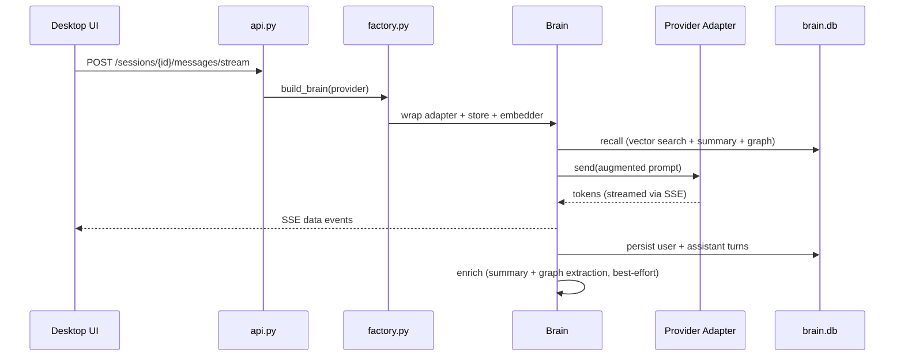
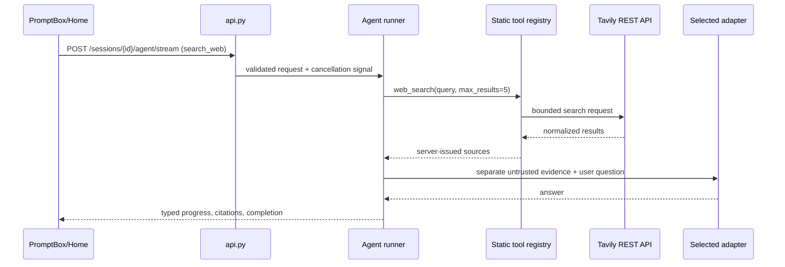
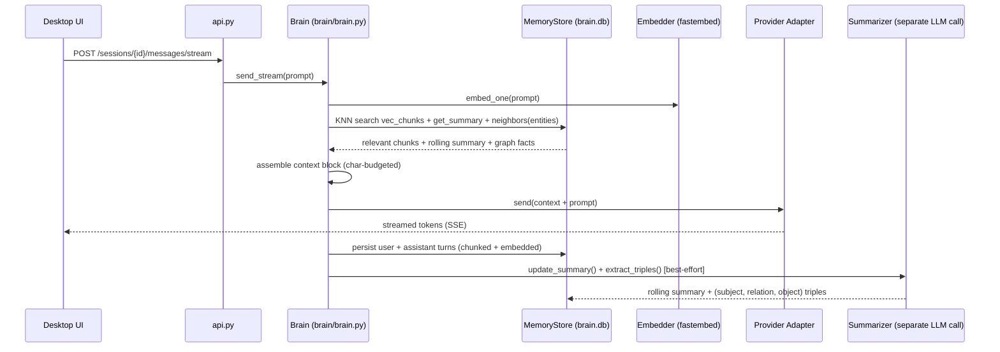

# Atlas

A desktop AI assistant: an Electron chat UI backed by a Python FastAPI server that talks to OpenAI, Anthropic, Gemini, OpenRouter, and any local OpenAI-compatible model (e.g. Ollama) through their official SDKs — with a persistent memory layer (RAG + rolling summary + entity graph) underneath all of them.


---

## Table of contents

- [Overview](#overview)
- [Features](#features)
- [System architecture](#system-architecture)
- [Feature flows](#feature-flows)
- [Data & storage](#data--storage)
- [The brain (persistent memory)](#the-brain-persistent-memory)
- [Provider adapters](#provider-adapters)
- [Project layout](#project-layout)
- [Quick start](#quick-start)
- [Configuration](#configuration)
- [API overview](#api-overview)
- [Development](#development)
- [Known limitations](#known-limitations)
- [Documentation index](#documentation-index)
- [License](#license)

---

## Overview

Atlas is a two-tier application:

| Tier | Stack | Role |
|---|---|---|
| **Desktop app** | Electron + React + TypeScript + Tailwind | Chat UI, local profile/auth, chat library, settings |
| **Backend server** | Python + FastAPI + official LLM SDKs | Provider routing, sessions, memory, credentials |

The desktop app talks to the backend over HTTP (`http://127.0.0.1:8000` by default). The backend exposes a single, provider-agnostic contract — the UI never imports provider SDKs directly.

Design goal: **nothing above the adapter layer needs provider-specific SDK logic.** Ordinary chat uses the stable `init` / `send` / `send_stream` / `close` / `new_chat` contract; agent runs use normalized `TurnMessage` and bounded tool-call contracts where the selected model advertises support.

---

## Features

### Implemented

- **Multi-provider chat** — OpenAI, Anthropic, Gemini, OpenRouter, and local OpenAI-compatible servers (Ollama, LM Studio, etc.)
- **Stateful sessions** — multi-turn conversations with per-session serialization
- **Token streaming** — SSE endpoint for live reply rendering in the UI
- **Vision input** — attach images to prompts (all chat adapters support image input)
- **Image generation** — OpenAI (`gpt-image-1`) and Gemini (`imagen-4.0-generate-001`) via `POST /images/generate`
- **Web search** — one bounded Tavily query (up to 5 displayed results) with source IDs, citations, and cancellation
- **Research mode** — plans up to 3 queries, keeps 12 unique results, reads at most 3 public pages, and validates citations within a 90-second run; selected text files stay local to that run
- **Safe tools** — bounded read-only provider tool calls for supported OpenAI, Anthropic, and Gemini models; no shell, arbitrary paths, or code execution
- **Plan and Write modes** — visible plan outline and response-style writing preset; neither executes actions
- **Document drafts** — choose a research brief, comparison, decision memo, or README; review the complete Markdown draft and destination before explicitly saving
- **Voice typing** — mic-button dictation: records audio in the renderer and transcribes it via Groq's `whisper-large-v3-turbo` API (see [Feature flows](#feature-flows))
- **Persistent memory (the brain)** — semantic recall, rolling summaries, and a lightweight entity/relation graph injected into every turn
- **Provider settings UI** — save API keys, test connections, configure local LLM base URL/model from Profile → Advanced
- **Chat library** — pin, search, and manage conversation history (synced to server-side `chats.db`)
- **App lock screen** — optional local password protection (bcrypt, stored in Electron userData)
- **Dark/light theme**, markdown rendering, code highlighting, HTML export

### Not included

Research Nodes/workspaces, automatic document writes, arbitrary shell/code execution, and model-selected tools for OpenRouter/local models are not available. Drafts remain chat artifacts until the user confirms a destination and save.

---

## System architecture

```
┌─────────────────────────────────────────────────────────────────────────┐
│                         Desktop (apps/desktop)                          │
│  Electron main process  │  React renderer (ChatArea, Sidebar, Profile)  │
│  - local auth/profile   │  - api.ts → HTTP to backend                   │
│  - IPC (export, lock)   │  - Zustand state, streaming SSE client        │
└────────────────────────────────────┬────────────────────────────────────┘
                                     │ HTTP (JSON / SSE)
                                     ▼
┌─────────────────────────────────────────────────────────────────────────┐
│                         Backend (server/)                               │
│                                                                         │
│  ┌──────────────┐    ┌──────────────┐    ┌──────────────────────────┐  │
│  │   api.py     │───▶│  factory.py  │───▶│  Brain (optional wrap)   │  │
│  │  FastAPI     │    │  wiring +    │    │  recall → send → persist │  │
│  │  endpoints   │    │  BRAIN_* cfg │    │  → enrich                │  │
│  └──────┬───────┘    └──────┬───────┘    └────────────┬─────────────┘  │
│         │                   │                         │                 │
│         │                   ▼                         ▼                 │
│         │          ┌─────────────────┐     ┌─────────────────┐        │
│         │          │  BaseAdapter    │     │  MemoryStore    │        │
│         │          │  (adapters/)    │     │  brain.db       │        │
│         │          └────────┬────────┘     │  sqlite-vec     │        │
│         │                   │              └─────────────────┘        │
│         │     ┌─────┬───────┼───────┬──────────┐                       │
│         │     ▼     ▼       ▼       ▼          ▼                       │
│         │  openai anthropic gemini openrouter local                    │
│         │                                                               │
│         ├── credentials_store.py  → credentials.db                     │
│         ├── chat_store.py         → chats.db                           │
│         ├── imagegen.py           → OpenAI / Gemini image APIs         │
│         ├── websearch.py          → Tavily REST API (search + research)│
│         └── voice.py              → Groq Whisper API (voice typing)    │
└─────────────────────────────────────────────────────────────────────────┘
```

### Request flow (chat turn)


```mermaid
sequenceDiagram
    participant UI as Desktop UI
    participant API as api.py
    participant Factory as factory.py
    participant Brain as Brain
    participant Adapter as Provider Adapter
    participant Store as brain.db

    UI->>API: POST /sessions/{id}/messages/stream
    API->>Factory: build_brain(provider)
    Factory->>Brain: wrap adapter + store + embedder
    Brain->>Store: recall (vector search + summary + graph)
    Brain->>Adapter: send(augmented prompt)
    Adapter-->>Brain: tokens (streamed via SSE)
    Brain-->>UI: SSE data events
    Brain->>Store: persist user + assistant turns
    Brain->>Brain: enrich (summary + graph extraction, best-effort)
```

### Layer responsibilities

| Layer | File(s) | Responsibility |
|---|---|---|
| **Presentation** | `server/api.py` | Authenticated HTTP endpoints, session registry, error mapping |
| **Wiring** | `server/factory.py` | Provider selection, brain config, singleton store/embedder |
| **Memory core** | `server/brain/` | Recall, persist, summarize, graph extraction |
| **Adapters** | `server/adapters/` | Provider-specific SDK wrappers behind `BaseAdapter` |
| **Credentials** | `server/credentials_store.py` | SQLite key/value for API keys and local LLM settings |
| **Chat persistence** | `server/chat_store.py` | SQLite store for the desktop app's chat library |
| **Agent workflows/tools** | `server/agents/`, `server/tools/` | Run policy, bounded Research, static tool registry, safe page fetch and selected-file search |
| **Web search / research** | `server/websearch.py` | Tavily REST API transport shared by Search and Research |
| **Voice typing** | `server/voice.py` | Groq Whisper (`whisper-large-v3-turbo`) transcription wrapper |
| **Desktop client** | `apps/desktop/src/renderer/src/lib/api.ts` | Typed HTTP client for all backend endpoints |

---

## Feature flows

How the explicit workflows move data end to end. `PromptBox` sends a typed mode; `Home.tsx` forwards it, while the server owns tool policy, limits, provider calls, and evidence. Ordinary chat, image generation, voice transcription, and Brain memory retain their separate paths.

### 1. Web search (Tavily)

Selecting **Search** runs one bounded Tavily query (up to 5 results). The backend passes source records as untrusted evidence to the selected model; it does not prepend search output to the user's prompt. Results are scoped to the run, citations use server-issued `[S#]` IDs, and the renderer opens only sources attached to that assistant message. Stop/disconnect cancels the search and prevents synthesis. Search inputs are limited to 1,000 characters; `/websearch` remains a validated compatibility endpoint, but the desktop agent mode uses `/sessions/{id}/agent/stream`.


```mermaid
sequenceDiagram
    participant UI as PromptBox/Home
    participant API as api.py
    participant Runner as Agent runner
    participant Registry as Static tool registry
    participant Tavily as Tavily REST API
    participant Model as Selected adapter

    UI->>API: POST /sessions/{id}/agent/stream (search_web)
    API->>Runner: validated request + cancellation signal
    Runner->>Registry: web_search(query, max_results=5)
    Registry->>Tavily: bounded search request
    Tavily-->>Registry: normalized results
    Registry-->>Runner: server-issued sources
    Runner->>Model: separate untrusted evidence + user question
    Model-->>Runner: answer
    Runner-->>UI: typed progress, citations, completion
```

### 2. Research mode

Research is a separate bounded workflow: one schema-validated planner produces 1–3 queries from the user question and recent typed conversation; Tavily requests run concurrently with at most 8 results each; results are deduplicated to 12; no more than 3 server-issued source IDs are fetched. Fetches allow public HTTP(S) text only, revalidate DNS and redirects, and cap each page at 10 seconds, 1 MiB, and 12,000 extracted characters. The entire run has a 90-second deadline.

Evidence is passed separately from the prompt and explicitly treated as untrusted. Up to 5 selected text files may be searched locally; file contents never enter Tavily queries. Inline web citations use `[S#]`, local-file citations use `[A#]`. Unknown IDs are removed; citation repair runs at most once, and missing/invalid citations or failed evidence mark the run partial. This structural check confirms ID existence, not claim truth.

The UI shows the query plan, result/fetch counts, source cards, and partial/error states. Raw pages and tool arguments are not sent to Brain memory; one user question and one final answer are persisted for the logical turn. Stopping or disconnecting prevents subsequent work.

### 3. Safe tools and document drafts

**Safe tools** is a per-message, read-only grant. It exposes only statically registered tools: public search/page fetch when no Brain or selected files are in scope, or current-thread memory and selected-file reads when private context is in scope. Search and Research remain the routes for public web queries with private context. The server enforces model capability, input schemas, call IDs, allowed names, a 4-round/6-call budget, a 90-second deadline, and output limits. Only the listed OpenAI, Anthropic, and Gemini models are enabled; OpenRouter and local models remain disabled. There is no shell, arbitrary code, SQL, disk-path access, or automatic write.

**Draft document** returns a Markdown chat artifact in one of four templates: research brief, comparison, decision memo, or README. It has no disk side effect. The user can review the complete content, choose a destination in Electron's native save dialog, see the selected path, and explicitly confirm save/replace. Electron main validates the filename and content, writes a temporary file in the destination directory, and atomically creates or replaces the selected file. The model never supplies an absolute path.

### 4. RAG / persistent memory (the brain)

Unlike search and voice, **the brain runs on every chat turn** (when `BRAIN_ENABLED=1`), independent of which tool (if any) is selected. It wraps whichever provider adapter is active behind the same `BaseAdapter` interface, so nothing upstream needs to know memory exists.


```mermaid
sequenceDiagram
    participant UI as Desktop UI
    participant API as api.py
    participant Brain as Brain (brain/brain.py)
    participant Store as MemoryStore (brain.db)
    participant Embed as Embedder (fastembed)
    participant Adapter as Provider Adapter
    participant Sum as Summarizer (separate LLM call)

    UI->>API: POST /sessions/{id}/messages/stream
    API->>Brain: send_stream(prompt)
    Brain->>Embed: embed_one(prompt)
    Brain->>Store: KNN search vec_chunks + get_summary + neighbors(entities)
    Store-->>Brain: relevant chunks + rolling summary + graph facts
    Brain->>Brain: assemble context block (char-budgeted)
    Brain->>Adapter: send(context + prompt)
    Adapter-->>UI: streamed tokens (SSE)
    Brain->>Store: persist user + assistant turns (chunked + embedded)
    Brain->>Sum: update_summary() + extract_triples() [best-effort]
    Sum-->>Store: rolling summary + (subject, relation, object) triples
```

Notes specific to how this interacts with the other three features:
- **Raw Search/Research pages and tool arguments are not embedded into `brain.db`.** An agent turn stores the original user question and final assistant answer once; the answer can still contain evidence-based facts that may be recalled later.
- **Voice-typed text is just text** — once transcription fills the textarea, that message goes through the exact same recall → send → persist → enrich pipeline as anything typed by hand. The brain has no idea it originated from audio.
- If the summarizer provider isn't configured, enrichment is skipped and the turn still gets recall + persistence (RAG-only degradation — see [The brain](#the-brain-persistent-memory)).

Full detail on chunking, embeddings, and the entity graph: [The brain (persistent memory)](#the-brain-persistent-memory).

### 5. Voice typing (Groq Whisper)

The browser's built-in `SpeechRecognition` (`webkitSpeechRecognition`) doesn't work in Electron — its backend is Google's speech service, gated behind an API key baked into official Chrome builds only, so it fails with a `network` error in any Chromium embedder. Voice typing instead records real audio locally and transcribes it server-side via Groq's Whisper API.

```mermaid
sequenceDiagram
    participant User
    participant Box as PromptBox (renderer)
    participant Rec as MediaRecorder
    participant API as api.py
    participant Voice as voice.py
    participant Groq as Groq Whisper API

    User->>Box: click mic
    Box->>Rec: getUserMedia({audio:true}) + start()
    User->>Box: click mic again (stop)
    Rec-->>Box: audio Blob (webm/opus)
    Box->>Box: Blob → base64 (FileReader)
    Box->>API: POST /audio/transcribe {data, mime}
    API->>Voice: transcribe(api_key, data, mime)
    Voice->>Groq: multipart POST /openai/v1/audio/transcriptions<br/>(model = whisper-large-v3-turbo)
    Groq-->>Voice: {text}
    Voice-->>API: text
    API-->>Box: {text}
    Box->>Box: insert into textarea (appended to any existing draft)
```

The Groq API key is stored the same way as every other provider key — via `credentials_store.py` (`GROQ_API_KEY`), managed from **Profile → Advanced → Voice typing**. If no key is configured, `/audio/transcribe` returns `400` and the UI shows "Add a Groq API key in Profile → Advanced to enable voice typing." instead of a raw error. Recording state (idle / recording / transcribing) is all client-side — the backend has no notion of an in-progress recording.

Key files: `chatgpt-prompt-input.tsx` (`handleMicClick`, `handleTranscription`), `server/api.py` (`POST /audio/transcribe`, `/settings/voice`), `server/voice.py`.

---

## Data & storage

Atlas uses several SQLite databases and Electron-local files. None of these should be committed to git.

| Store | Location | Contents |
|---|---|---|
| `brain.db` | `server/` (configurable via `BRAIN_DB_PATH`) | Threads, messages, vector chunks, entity graph |
| `credentials.db` | `server/` (configurable via `CREDENTIALS_DB_PATH`) | API keys, local LLM URL/model — overrides `.env` at runtime |
| `chats.db` | `server/` (configurable via `CHATS_DB_PATH`) | Chat library metadata and messages synced from the desktop app |
| Electron userData | OS app-data directory | Local user profile, app password hash, session state |

**Credential precedence:** `.env` seeds the first value for each key. Keys saved via Profile → Advanced are written to `credentials.db` and take effect immediately without a server restart.

---

## The brain (persistent memory)

When `BRAIN_ENABLED=1` (default), every chat turn passes through the brain — a `BaseAdapter`-shaped orchestrator that wraps any provider adapter and gives the app long-term memory across all conversations.

On each `send()` / `send_stream()`:

1. **Recall** — embed the prompt, KNN-search past chunks (`sqlite-vec`), pull the thread's rolling summary, and add 1-hop graph facts for entities named in the prompt. Assemble a char-budgeted context block and prepend it to the prompt.
2. **Delegate** — call the underlying adapter with the augmented prompt. Adapters are untouched.
3. **Persist** — store the original user prompt and assistant reply. Long messages are semantically chunked (`langchain-experimental` `SemanticChunker`) and batch-embedded into `vec_chunks`.
4. **Enrich** (best-effort, toggleable) — a separate summarizer adapter folds the turn into the rolling summary and extracts `(subject, relation, object)` triples into the entity/edge graph. Failures never break the chat.

### Brain components

| Component | File | Technology |
|---|---|---|
| Storage | `brain/db.py`, `brain/store.py`, `brain/schema.sql` | SQLite + `sqlite-vec` (384-dim cosine) |
| Embeddings | `brain/embeddings.py` | `fastembed` — `BAAI/bge-small-en-v1.5` (ONNX, no torch) |
| Chunking | `brain/chunking.py` | LangChain `SemanticChunker` with hard char-cap fallback |
| Retrieval | `brain/retriever.py` | Vector search + summary + graph context assembly |
| Summarizer | `brain/summarizer.py` | Separate LLM call per turn (uses `BRAIN_SUMMARIZER` provider) |

### Brain configuration

All knobs live in `.env` (see `server/.env.example`):

| Variable | Default | Purpose |
|---|---|---|
| `BRAIN_ENABLED` | `1` | `0` = plain adapters, no memory |
| `BRAIN_AUTO_SUMMARY` | `1` | `0` = RAG only (no LLM summary/graph, saves quota) |
| `BRAIN_SUMMARIZER` | `openai` | Provider used for summary + graph extraction |
| `BRAIN_TOPK` | `6` | Semantic hits injected per turn |
| `BRAIN_MAX_DISTANCE` | `0.6` | Cosine-distance cutoff for dynamic recall |
| `BRAIN_CONTEXT_BUDGET` | `2000` | Max chars of recalled context per turn |
| `BRAIN_CHUNK_CHARS` | `800` | Hard cap on chunk size before re-windowing |

If the summarizer provider is not configured, the brain degrades gracefully to **RAG-only** rather than failing.

---

## Provider adapters

Every provider implements the same contract in `server/adapters/base.py`:

```python
async def init() -> None                          # set up client (call once)
async def send(prompt, images?) -> Reply          # full reply, keeps context
async def send_stream(prompt, images?) -> AsyncIterator[str]  # token stream
async def close() -> None                         # release resources
async def new_chat() -> None                      # drop conversation context
```

| Provider | Adapter | SDK | Auth |
|---|---|---|---|
| OpenAI | `openai_adapter.py` | `openai` | `OPENAI_API_KEY` |
| Anthropic | `anthropic_adapter.py` | `anthropic` | `ANTHROPIC_API_KEY` |
| Gemini | `gemini_adapter.py` | `google-genai` | `GEMINI_API_KEY` |
| OpenRouter | `openrouter_adapter.py` | OpenAI-compatible, `base_url` override | `OPENROUTER_API_KEY` |
| Local | `local_adapter.py` | OpenAI-compatible, user `base_url` | none (defaults to Ollama at `http://localhost:11434/v1`) |

Agent tool support is model-specific: OpenAI supports fragmented streamed arguments; Anthropic and Gemini normalize complete tool calls; OpenRouter and local models advertise no native tool support. Adding a provider requires an adapter, factory wiring, and an explicit capability entry in `/providers` before the UI offers safe tools.

---

## Project layout

```
Atlas/
├── apps/desktop/              Electron + React + TypeScript desktop UI
│   ├── src/main/              Electron main process (IPC, auth, export)
│   ├── src/preload/           Context bridge (window.api)
│   └── src/renderer/          React app
│       └── src/
│           ├── components/    ChatArea, Sidebar, Profile, Library, …
│           ├── lib/api.ts     HTTP client for the backend
│           └── pages/         Home, About
│
├── server/                    Python FastAPI backend
│   ├── api.py                 HTTP layer (endpoints, sessions, bearer auth)
│   ├── factory.py             Provider wiring + brain config
│   ├── credentials_store.py   API key persistence
│   ├── chat_store.py          Chat library persistence
│   ├── imagegen.py            Image generation (OpenAI, Gemini)
│   ├── websearch.py           Tavily web search
│   ├── adapters/              Provider adapter implementations
│   ├── brain/                 Persistent memory core
│   ├── tests/                 Backend tests
│   ├── ARCHITECTURE.md        Deep technical architecture reference
│   ├── FRONTEND.md            HTTP contract for frontend developers
│   └── README.md              Server setup and endpoint reference
│
├── LICENSE                    MIT
└── README.md                  This file
```

---

## Quick start

### Prerequisites

- **Python 3.11+** with `pip`
- **Node.js 20+** with `npm`
- At least one LLM provider API key (or a running local model server)

### 1. Start the backend

Development requires the **same** random `ATLAS_API_TOKEN` (at least 32 ASCII
characters) in the backend and desktop process environments. Generate it once
and share it through your local environment manager; do not put it in a URL,
commit it, or print it in logs. Packaged desktop builds create a fresh token at
launch and pass it directly to their embedded server. All API routes require
`Authorization: Bearer <token>`; CORS permits only the packaged desktop and local Vite origins.

```powershell
cd server
python -m venv .venv
.venv\Scripts\activate
pip install -r requirements.txt
copy .env.example .env   # paste at least one provider API key
$env:ATLAS_API_TOKEN = python -c "import secrets; print(secrets.token_hex(32))"
uvicorn api:app --reload
```

Every API route requires `Authorization: Bearer $ATLAS_API_TOKEN`, including `/docs` and `/openapi.json`. Development desktop and server must inherit the same 32+ character token. The packaged desktop generates a per-launch token for its embedded backend. CORS is restricted to the desktop origin and local Vite; the bearer token is not multi-user authentication.

On first run with the brain enabled, the embedding model (~50 MB) downloads once via `fastembed`, then works offline.

### 2. Start the desktop app

In a separate terminal with the **same** `ATLAS_API_TOKEN` set:

```powershell
cd apps\desktop
npm install
npm run dev
```

### 3. Configure providers

Either edit `server/.env` before starting the backend, or from inside the app:

**Profile → Advanced** — save API keys, test connections, set local LLM base URL/model.

For Ollama (or any OpenAI-compatible local server):

```dotenv
LOCAL_LLM_BASE_URL=http://localhost:11434/v1
LOCAL_LLM_MODEL=llama3.2
```

For web search (and research mode), add a Tavily API key in Advanced settings or set `TAVILY_API_KEY` in `.env`.

For voice typing, add a Groq API key (from [console.groq.com](https://console.groq.com)) in Advanced settings or set `GROQ_API_KEY` in `.env`.

---

## Configuration

Copy `server/.env.example` to `server/.env`. All keys are optional — a provider is simply unavailable if its key is missing.

```dotenv
# Provider API keys
OPENAI_API_KEY=
ANTHROPIC_API_KEY=
GEMINI_API_KEY=
OPENROUTER_API_KEY=

# Local LLM (no key required)
LOCAL_LLM_BASE_URL=http://localhost:11434/v1
LOCAL_LLM_MODEL=llama3.2

# Web search / research mode (Tavily)
TAVILY_API_KEY=

# Voice typing (Groq Whisper)
GROQ_API_KEY=

# Brain (persistent memory) — see server/.env.example for all BRAIN_* knobs
BRAIN_ENABLED=1
BRAIN_DB_PATH=brain.db
```

**Never commit `.env`, `brain.db`, `credentials.db`, or `chats.db`.**

In development, the desktop renderer uses `VITE_API_BASE_URL` (default
`http://127.0.0.1:8000`). The bearer token is sent only to an HTTP loopback backend. Packaged apps launch the bundled backend on an available loopback port and receive its URL and per-launch bearer token from Electron; they do not depend on or reuse a separately running server.

---

## API overview

Every HTTP endpoint, including API docs, requires `Authorization: Bearer <token>`.
CORS permits only the packaged desktop origin and local Vite.

Two chat modes:

| Mode | Endpoints | Context |
|---|---|---|
| **Stateless** | `POST /chat` | No conversation context retained between calls |
| **Stateful** | `POST /sessions` → `POST /sessions/{id}/messages` | Multi-turn, server-side session registry |

With the brain enabled, **both** modes write to and recall from global memory. Sessions additionally keep the provider's own turn-by-turn context.

### Key endpoints

| Method | Path | Purpose |
|---|---|---|
| `GET` | `/providers` | List providers, suggested models, capabilities |
| `GET/PUT/DELETE` | `/settings/providers[/{provider}]` | Read/write/clear API keys and local LLM settings |
| `POST` | `/settings/providers/{provider}/test` | Verify a provider connection with a real prompt |
| `POST` | `/chat` | One-shot stateless chat |
| `POST` | `/sessions` | Open a stateful multi-turn session → `session_id`, `thread_id` |
| `POST` | `/sessions/{id}/messages` | Send a prompt (full reply) |
| `POST` | `/sessions/{id}/messages/stream` | Send a prompt (SSE token stream) |
| `POST` | `/sessions/{id}/new_chat` | Reset conversation context |
| `DELETE` | `/sessions/{id}` | Close and drop session |
| `POST` | `/images/generate` | Standalone image generation (OpenAI, Gemini) |
| `POST` | `/websearch` | Validated Tavily compatibility endpoint; desktop modes use the agent stream |
| `GET/PUT/DELETE` | `/settings/search` | Tavily API key management |
| `POST` | `/audio/transcribe` | Voice typing — transcribe recorded audio via Groq Whisper |
| `GET/PUT/DELETE` | `/settings/voice` | Groq API key management |
| `GET` | `/memory/search?q=` | Plain semantic search across all memory |
| `POST` | `/memory/search` | Graph-aware search (vector hits + entity facts) |
| `GET` | `/threads/{id}/summary` | Thread rolling summary |
| `GET` | `/threads/{id}/graph` | Thread entity/relation graph |
| `GET/POST` | `/chats` | Read/write chat library (desktop sync) |
| `POST` | `/account/reset` | Wipe credentials, chats, and brain memory |

Full request/response shapes, error codes, and suggested frontend flows: [`server/FRONTEND.md`](server/FRONTEND.md).

---

## Development

### Backend

```powershell
cd server
.venv\Scripts\activate
uvicorn api:app --reload          # dev server with auto-reload
.venv\Scripts\python -m pytest    # run tests (if pytest installed)
.venv\Scripts\python tests/test_brain.py   # smoke-test brain offline
```

> Always use the `.venv` interpreter. Installing packages with a different `python` on your PATH puts them in the wrong environment.

### Desktop

```powershell
cd apps\desktop
npm run dev           # dev with HMR
npm run typecheck     # TypeScript check
npm run lint          # ESLint
npm run build:win     # production build for Windows
npm run build:mac     # production build for macOS
npm run build:linux   # production build for Linux
```

Recommended IDE: VS Code with ESLint + Prettier extensions.

### Adding a provider

1. Create `server/adapters/my_provider_adapter.py` — subclass `BaseAdapter`.
2. Export it from `server/adapters/__init__.py`.
3. Add a branch in `build_adapter()` in `server/factory.py`.
4. Add the provider to `PROVIDERS` and `MODELS` in `factory.py`.
5. Add the env key to `PROVIDER_ENV_KEYS` in `api.py` and `.env.example`.

No API endpoint changes required.

---

## Known limitations

- **Session registry is in-memory and single-process** — live adapter sessions are lost on restart. Durable memory, indexed documents, and messages persist in `brain.db`. The per-run bearer token protects the local API, but is not multi-user authentication; a hosted deployment needs separate identity and shared session state.
- **Brain memory is single-file SQLite** — not concurrent multi-writer. For scale, swap `MemoryStore` for Postgres + pgvector.
- **Graph is lightweight** — single-pass triple extraction, no community detection or hierarchical summaries. Summarization costs provider quota and latency per turn (disable with `BRAIN_AUTO_SUMMARY=0`).
- **Local-only API** — bound to loopback; CORS permits only the packaged Electron opaque origin and local Vite. Do not expose it publicly or treat the token as multi-user authorization.
- **Windows + fastembed** — HuggingFace cache may warn about symlink privilege (`WinError 1314`) on first model download. It falls back to copy and works. Enable Developer Mode to silence it.

---

## Documentation index

| Document | Audience | Contents |
|---|---|---|
| [`server/README.md`](server/README.md) | Backend developers | Setup, providers table, endpoint quick reference, brain smoke test |
| [`server/ARCHITECTURE.md`](server/ARCHITECTURE.md) | Contributors | Adapter contract, factory, brain internals, per-provider notes |
| [`server/FRONTEND.md`](server/FRONTEND.md) | Frontend developers | Full HTTP contract, Reply shape, error codes, suggested chat flow |
| [`apps/desktop/README.md`](apps/desktop/README.md) | Desktop developers | Electron build commands |

---

## License

MIT — see [`LICENSE`](LICENSE).
